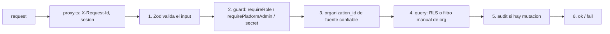

# Repository Guidelines

> Contrato portable para **cualquier** agente de código (Codex, Cursor, OpenCode, Antigravity, Copilot).
> Este archivo es el núcleo. La **doctrina completa y no negociable vive en [`CLAUDE.md`](CLAUDE.md)** —
> léela antes de tocar código. El mapa de toda la documentación está en [`docs/index.md`](docs/index.md).
> Precedencia cuando dos documentos no coinciden: `CLAUDE.md` > `docs/specs/` > `docs/prd/` >
> `HANDOFF-*.md` > `README.md`.

## Project Overview

Sistema operativo de ventas open source con agentes de IA nativos, multinicho (e-commerce,
clínicas, inmobiliarias, infoproductos, servicios), WhatsApp como canal primario vía WAHA, el CRM
entero expuesto por MCP. Multi-tenant con RLS desde el día 1; LGPD nativa. Monetización =
**self-host en VPS**, no suscripción. Posicionamiento: [`VISION.md`](VISION.md); estado real de
implementación: [`docs/current-state.md`](docs/current-state.md).

**Consecuencia que cambia cómo trabajas:** el producto se distribuye como código. Quien lo instala
en un VPS **es** el usuario. Un cambio que funciona en la máquina del dev y se rompe en el clon fresco es
un **bug de producto**, no un detalle de entorno. Nada que exija editar archivos a mano en el VPS entra.

Stack canónico (major; la versión exacta es el `package.json`):

Next.js 16 (App Router, Turbopack) · React 19 · TypeScript 6 estricto · Tailwind 4 (config en CSS) ·
shadcn/ui (`new-york`) · Supabase (Postgres + Auth + Realtime + Storage) · Zod 4 · Vitest 4 ·
Playwright 1 · Sentry 11 · WAHA 2026.7.2 (engine NOWEB) · Upstash Redis · Vercel AI Gateway
(`@ai-sdk/anthropic|openai|google`).

> Las majors de arriba se verifican contra el `package.json` con
> [`tests/unit/agents-md-versoes.test.ts`](tests/unit/agents-md-versoes.test.ts) — declara **solo la
> major**; afirmar la minor en prosa crea una deuda que ningún gate cobra y traba los bumps de Dependabot.
> Un test hermano,
> [`tests/unit/documentacao-aponta-para-o-que-existe.test.ts`](tests/unit/documentacao-aponta-para-o-que-existe.test.ts),
> rechaza toda ruta citada aquí que no exista en el disco.

## Architecture & Data Flow

- **App** — Next.js 16 App Router: UI + Route Handlers en el mismo repo. Server Components por
  default; `"use client"` solo con estado/evento/API del navegador. Middleware de borde en `proxy.ts`
  (Next 16 renombró `middleware.ts` → `proxy.ts`; inyecta `X-Request-Id` y `x-pathname` y
  autentica la sesión antes de la ruta).
- **DB** — Supabase Postgres. RLS en toda tabla tenant-aware vía helper
  (`fn_user_org_ids()`/`fn_user_role_in_org()`), la misma función SECURITY DEFINER que usa el RBAC de
  la aplicación. Schema versionado en `supabase/migrations/`; lo que aplica el self-host es
  `supabase/baseline.sql`.
- **Auth** — Supabase Auth + `@supabase/ssr`, cookie `SameSite=Strict`. Siempre `getUser()` en el
  server; **nunca** `getSession()`. MFA TOTP es opcional y lo activa quien administra
  (dos políticas que se suman: plataforma y organización), regla pura en
  `lib/auth/politica-mfa.ts`.
- **Colas** — event sourcing ligero: `event_log` + workers drenados por cron. Un trigger de Postgres
  **nunca** hace HTTP.
- **IA** — Vercel AI Gateway (Anthropic primario, OpenAI para embeddings), RAG por tenant,
  guardrails antes de enviar.
- **Tiempo real** — Supabase Realtime (`postgres_changes` para inbox/kanban, `broadcast` para
  señales ligeras). **Storage** — bucket privado `whatsapp-media`, URL firmada.

Flujo de una ruta autenticada de tenant:



Superficies **sin cookie** (cada una con su propio guard, nunca la cookie de sesión):
`app/api/v1/cron/` (Bearer `INTERNAL_CRON_SECRET`, fail-closed), `app/api/internal/`
(`x-internal-secret`), `app/api/mcp/` (Bearer `dsk_...` contra `api_tokens`), `app/api/v1/webhooks/`
(HMAC + path token), y **parte de `app/api/v1/`** — rutas que aceptan cookie O bearer mediante el helper
`lib/api/auth-dual.ts`. Esta última crece ruta por ruta (decisión del dueño el 17/09/2026: convertir
lo que cada integración necesite), así que el inventario es un comando y no una lista:
`git grep -ln "auth-dual" -- app/api/v1`. Una ruta con el helper **también** necesita una entrada en
`lib/auth/public-paths.ts`; si no, el `proxy.ts` devuelve 401 antes del handler. Inventario y superficie de ataque: [`docs/threat-model.md`](docs/threat-model.md).

Turno del agente de IA: inbound de WhatsApp → HMAC + idempotencia → `event_log` → worker →
`runAgentTurn` (RAG + tools MCP) → guardrails → adapter WAHA → handoff a humano si se dispara el
disparador. Entrada del turno en `lib/agent-engine/agent/inbound-turn.ts`; diagrama en
`docs/architecture/agent-turn.html`.

| Path | Qué es |
|---|---|
| `app/api/v1/` | Route handlers REST (versionado por path) — **recuenta, no cites**: `git ls-files 'app/api/v1/**/route.ts' \| wc -l` (y `git ls-files 'app/api/**/route.ts' \| wc -l` para el total de `app/api/**`) |
| `app/api/internal/`, `app/api/mcp/`, `app/api/v1/cron/` | superficies sin cookie (secret/bearer propio) |
| `app/app/` | UI autenticada del tenant · `app/admin/` UI de plataforma |
| `app/actions/` | Server Actions (auth, onboarding, team, settings) |
| `lib/agent-engine/`, `lib/ai/` | runtime del agente, guardrails, RAG, dispatcher |
| `lib/api/wrappers.ts` | `ok()` / `fail()` — **úsalos siempre**, no armes el Response a mano |
| `lib/auth/require-role.ts` | `requireRole()` — guard canónico de RBAC |
| `lib/supabase/{browser,server,admin}.ts` | clients canónicos |
| `workers/` | workers de `event_log` + crons |
| `supabase/migrations/` | schema versionado · `supabase/baseline.sql` = lo que aplica el self-host |
| `proxy.ts` | middleware de Next 16 (auth de borde, `X-Request-Id`) |
Idempotencia de worker: `unique (organization_id, external_id)` + captura de `code === '23505'`.
Contrato completo en [`docs/specs/07-spec-events-workers.md`](docs/specs/07-spec-events-workers.md).

## Key Directories

| Path                    | Qué es                                                                                                          |
| ----------------------- | --------------------------------------------------------------------------------------------------------------- |
| `app/api/`              | Route handlers REST, versionados por path. Cuenta cuántos hay: `git ls-files 'app/api/**/route.ts' \| wc -l`    |
| `app/app/`              | UI autenticada del tenant                                                                                       |
| `app/admin/`            | UI de plataforma (platform admin)                                                                               |
| `app/actions/`          | Server Actions (auth, onboarding, team, settings)                                                               |
| `lib/agent-engine/`     | Runtime del agente: turno inbound/outbound, playbooks, handoff, follow-up, memoria de la org                    |
| `lib/ai/`               | Modelos, costo, presupuesto, RAG, dispatcher, catálogo de providers                                             |
| `lib/channels/`         | Abstracción de canal (invariante de restricción de canal)                                                       |
| `lib/api/`              | `wrappers.ts` (`ok()`/`fail()`) y `errors.ts` (catálogo de códigos)                                             |
| `lib/auth/`             | `server.ts` (sesión/org), `require-role.ts` (`requireRole`), `public-paths.ts` (borde)                          |
| `lib/supabase/`         | Clients canónicos: `browser.ts`, `server.ts`, `admin.ts` (service role)                                         |
| `lib/branding/`         | Marca propia (white-label) — se resuelve desde la base de datos, nunca desde el .env                            |
| `workers/`              | Workers de `event_log` + crons                                                                                  |
| `components/`, `hooks/` | React compartido; convenciones en el README de cada carpeta                                                     |
| `supabase/migrations/`  | Schema versionado + `MANIFEST.md`; `supabase/baseline.sql` es lo que aplica el self-host                        |
| `hostgator-setup-kit/`  | Kit de instalación/actualización del VPS (`install.sh`, `update.sh`, `diagnostico.sh`, `healthcheck.sh`)        |
| `scripts/`              | CLIs de operación y QA — ver `scripts/README.md`                                                                |
| `tests/`                | `unit/`, `invariants/`, `e2e/`, `shell/`, `journeys/`, `fixtures/`                                              |
| `docs/`                 | Doctrina, PRDs, specs, reglas de negocio, runbooks, design system — entrada en `docs/index.md`                  |
| `.agents/skills/`       | Guías del asistente embutidas (espejo en `.claude/skills/`, regenerado por `pnpm skills:sync`)                  |

## Development Commands

```bash
pnpm install          # deps (frozen-lockfile en el CI)
pnpm dev              # dev server
pnpm build            # next build
pnpm lint             # eslint
pnpm typecheck        # tsc --noEmit -p tsconfig.typecheck.json (incluye tests/)
pnpm test:unit        # vitest — EXCLUYE tests/invariants, tests/e2e y tests/journeys (lista viva en vitest.config.ts → exclude)
pnpm test:db          # invariantes de base de datos + gate del baseline (NECESITA Docker)
pnpm test:e2e         # Playwright (NECESITA la app corriendo + base sembrada)
pnpm gov:verify       # typecheck + lint + lint:channels + lint:role-rank + test:unit
                      # ← verificación única actual; el encadenamiento real sale de:
                      #   node -e "console.log(require('./package.json').scripts['gov:verify'])"
pnpm lint             # eslint (flat config)
pnpm typecheck        # tsc --noEmit -p tsconfig.typecheck.json
pnpm test:unit        # vitest run — EXCLUYE tests/e2e, tests/invariants, tests/journeys
pnpm test:db          # invariantes de base de datos + gate del baseline (NECESITA Docker)
pnpm test:e2e         # Playwright (NECESITA la app buildeada + .env.e2e)
pnpm test:shell       # scripts del kit self-host (bash)
pnpm gov:verify       # typecheck + lint + lint:channels + lint:role-rank + test:unit
```

⚠️ **`pnpm gov:verify` no lo cubre todo.** Omite `test:db`, `test:e2e` **y** `test:shell`.
Si el cambio toca schema/RLS/tabla tenant-aware, corre `pnpm test:db`. Si toca UI o un flujo de
usuario, corre `pnpm test:e2e` con evidencia visual. Si toca `Dockerfile*`, `docker-compose*` o
`hostgator-setup-kit/`, corre `pnpm test:shell` — es el único gate que ejercita el kit.

**Lo que cubre el CI.** `.github/workflows/ci.yml`: `verify` = los pasos del job, en orden —
typecheck, lint, `lint:channels`, `test:unit` y `test:shell` hoy, y `pnpm lint` solo **no**
cubre los dos últimos (lístalos en vez de creerle a esta línea:
`awk '/^  verify:/,/^  invariants-majors:/' .github/workflows/ci.yml | grep -A1 'name:'`);
`invariants` = fachada sobre la matriz `invariants-majors`, que corre `pnpm test:db` (aislamiento
RLS + invariantes de gobernanza) y `pnpm test:db:update` (actualizar una base CON datos) una vez por
cada major de Postgres soportada. `.github/workflows/perf.yml`: `build-and-size` = `pnpm build`.
`.github/workflows/e2e.yml` corre las specs de Playwright contra un Supabase local de verdad con
el `baseline.sql` aplicado — la misma base que tiene quien se auto-hospeda. **Es check obligatorio** — la
fecha de activación no es auditable desde el repositorio, y la lista viva está justo abajo, con el
comando al lado. **No hay número aquí a propósito**: esta línea ya afirmó un conteo exacto
de specs y "la única que queda fuera", y las dos cosas envejecieron — la suite crece cada semana y la lista de
excepciones cambia con ella. Quién queda fuera es lo que declara la propia variable; léela, no confíes:
El CI tiene cinco checks obligatorios en `main`: `verify`, `build-and-size`, `invariants`, `e2e`,
`imagens-ok`. No confíes en esta lista — vuelve a contar antes de citar:

```bash
gh api repos/melgarafael/DeskcommCRM/branches/main/protection \
  --jq '.required_status_checks.contexts|join(", ")'
```

`e2e` corre las partes de su matrix en paralelo (cuántas:
`git show origin/main:.github/workflows/e2e.yml | grep -E '^ +parte: \['` — esta línea decía
"tres" hasta que el PR #983 agregó la cuarta); las specs que quedan fuera están declaradas, **con motivo
escrito**, en `FORA_DO_CI` dentro de `.github/workflows/e2e.yml`. Léelo en vez de suponer:

```bash
git show origin/main:.github/workflows/e2e.yml | grep -A4 'FORA_DO_CI:'
```

## Embedded Assistant Guides

El repositorio embute guías en `.agents/skills/` (las leen Codex, Cursor, OpenCode, Antigravity;
Claude Code lee el espejo en `.claude/skills/`). Carga la guía cuando el pedido coincida, aunque
la persona no sepa que existe — `tests/unit/skills-embutidas.test.ts` exige que este archivo
cite cada una:

**Los cinco son checks obligatorios** en la branch protection de `main` — medido el 2026-08-14 @ `741c4ec8` (el comando exige permiso de **admin** en el repositorio: con un token de contribuyente devuelve `404`, medido el 2026-09-13):
| Situación                                                                             | Guía                    |
| ------------------------------------------------------------------------------------- | ----------------------- |
| Instalar, actualizar o arreglar la instalación en un VPS; dominio, Supabase, WhatsApp | `deskcomm-instalar`     |
| Configurar el CRM para un cliente o nicho: agentes, enrutadores, follow-ups, base     | `deskcomm-cliente-novo` |
| Desempeño, conversión, costo de IA, embudo, reporte                                   | `deskcomm-metricas`     |
| El agente responde mal, le pasa todo a un humano, no usa la agenda; afinar el prompt  | `deskcomm-prompt`       |
| Contribuir: corregir un bug, abrir o actualizar un PR, migration, conflicto con `main` | `deskcomm-contribuir`   |
| Crear una extensión/plugin/módulo de nicho, o convertir un PR de nicho en paquete     | `deskcomm-extensao`     |
| Escribir o revisar código aquí                                                        | `deskcomm-doutrina`     |

El gate de arquitectura de cualquier pieza que atiende personas es la skill `sistema-vivo` (ley en
[`docs/doctrine/sistema-vivo.md`](docs/doctrine/sistema-vivo.md)).

## Code Conventions & Common Patterns

**Receta de route handler** — en este orden, sin atajos:

1. Zod valida **todo** input externo (body, query, path).
2. Guard canónico: `requireRole()` de `lib/auth/require-role.ts`,
   `requirePlatformAdmin`, o secret/HMAC. Nunca reimplementes la comparación de rango a mano.
   Un handler **que muta** en `app/api/v1` declara además `requireSupportWrite(` (`lib/impersonate/support.ts`)
   antes del efecto: bloquea la escritura en `support_readonly` y no sustituye RBAC/MFA.
3. `organization_id` resuelto de una **fuente confiable** (cookie/JWT/webhook secret/path token) —
   **nunca del body**.
4. Query: RLS con el client de sesión, o filtro manual de `organization_id` cuando usa service role.
5. `audit()` (fire-and-forget) si hubo mutación.
6. Responde con `ok()` / `fail()` de `lib/api/wrappers.ts` — nunca armes un `Response` a mano.

```ts
const authz = await requireRole("manager", { requestId });
if (!authz.ok) return authz.response;
```

**Errores** — `fail(code, message, status)` con un código de `lib/api/errors.ts`. Nunca un `throw` crudo en el
borde. Cada response lleva `X-Request-Id`, correlacionado con el audit log.

**Nombres y datos** — archivos y símbolos en PT-BR son la norma (mantén el idioma del archivo que
edites; la documentación de raíz de este fork está en español). JSON de la API en **snake_case**; dinero en `_cents` + `currency`; fechas ISO-8601 UTC;
UUID v4. Tests junto al código (`lib/foo/bar.test.ts`) o en `tests/`.

**Log** — `lib/logger.ts` (estructurado, JSON). `console.log` está prohibido en código mergeado —
`no-console` es `warn` en ESLint y el DoD cubre el resto. Nunca registres en logs un secreto, token, CPF, teléfono
o correo; el `beforeSend` de Sentry sanitiza, pero no es la única capa.

**Multi-tenancy** — `organization_id uuid not null references organizations(id) on delete cascade`
en toda tabla tenant-aware. `lib/supabase/admin.ts` **se salta la RLS**: toda query con service role
filtra `organization_id` manualmente. No hay gate automático para eso — la responsabilidad es tuya.

**Migrations** — un cambio de schema sale **siempre** como tripleta: migration versionada en
`supabase/migrations/`, apéndice idempotente en `supabase/baseline.sql` y línea en
`supabase/migrations/MANIFEST.md`. Nunca edites una migration ya aplicada; corrige con una nueva.
Una función nueva en `public` necesita `revoke execute ... from public, anon` **y** `grant` — son
dos orígenes de `EXECUTE`.
⚠️ Y **no leas el baseline con `grep` sobre el archivo entero**: es dump + apéndice, la misma
función aparece varias veces, y la que vale es la **última**. Pregúntale a la base de datos después de aplicar
(`pg_get_functiondef`) o ancla en el último `create or replace` (`rfind`, nunca `find`).
Contar en el archivo responde "el archivo menciona", no "la base de datos hace".

**Marca propia (white-label)** — el producto se revende y el nombre no es tuyo. **Nunca** escribas
"Deskcomm"/"DeskcommCRM" en código que llega al usuario: `tests/unit/branding.test.ts` recorre
`app|components|lib|workers|hooks` y lo rechaza (la allowlist solo se encoge). La marca se resuelve desde la base de datos
(`platform_branding`, `organizations.settings.branding`); `APP_NAME`/`APP_LOGO_URL`/`APP_ACCENT_HEX`
en el `.env` son semilla y piso de rollback. Fuera del DOM (correo, ícono, `issuer` del MFA) usa
`marcaDaSaida()` de `lib/branding/saida.ts`. El resolvedor **nunca lanza** — corre en
`app/layout.tsx` y un throw ahí es un 500 en todas las pantallas. El PDF de LGPD no lleva marca: nombra
al controlador (`organizations.legal_name`) y al DPO.

- **`supabase/baseline.sql`** — es lo que aplican `install.sh`/`update.sh` del self-host.
  Todo cambio de schema tiene que aparecer aquí **como apéndice idempotente**; si no,
  no llega a quien ya instaló. Ver la doctrina de Migrations en `CLAUDE.md`.
- **`supabase/migrations/*.sql` ya aplicadas** — nunca las edites. Corrige con una migration nueva.
- **`lib/supabase/admin.ts`** — el service role **se salta la RLS**. Buena parte de los handlers de
  `app/api/**` lo usa — vuelve a contar en vez de citar:
  `grep -rl createAdminClient app/api --include='route.ts' | wc -l` contra
  `git ls-files 'app/api/**/route.ts' | wc -l`. Toda query necesita filtrar
  `organization_id` manualmente, resuelto de una fuente confiable
  (cookie/JWT/webhook secret/path token), **nunca del body**.
- **`lib/auth/public-paths.ts`** — agregar un path aquí quita la verificación de auth de borde.
  Solo con un guard propio dentro de la ruta.
- **`.env*`** — no lo abras, no copies valores, no los registres en logs. Solo `.env.example` es plantilla.
- **`docker-compose.traefik.yml`** — en un VPS que ya tiene su propio proxy inverso
  (Hostinger, Coolify, Dokploy…), es el único lugar que le da al contenedor `app` las labels
  de enrutamiento. Todo `up -d` lleva **los dos** archivos de compose:
**Anti-patterns prohibidos** — un string que debería ser FK; duplicación sin source of truth declarado;
una feature que nombra a un proveedor de canal (gate `pnpm lint:channels`); una pantalla nueva sin puerta declarada en
`lib/navigation/registry.ts` (gate `tests/unit/navegacao-completude.test.ts`); `getSession()` en el
server; un secreto en query string; un `throw` crudo en el borde de la API.

## Important Files

| Archivo                                    | Por qué                                                                          |
| ------------------------------------------ | -------------------------------------------------------------------------------- |
| `proxy.ts`                                 | Middleware de borde de Next 16: auth, `X-Request-Id`, impersonation              |
| `lib/api/wrappers.ts`                      | `ok()` / `fail()` — formato de respuesta y `X-Request-Id`                        |
| `lib/api/errors.ts`                        | Catálogo de códigos de error                                                     |
| `lib/auth/require-role.ts`                 | `requireRole()` — guard canónico de RBAC                                         |
| `lib/auth/server.ts`                       | `loadAuthUser()`, `resolveActiveOrg()` — sesión y org activa                     |
| `lib/auth/public-paths.ts`                 | Allowlist de paths sin auth de borde (solo con guard propio dentro de la ruta)   |
| `lib/supabase/admin.ts`                    | Service role — **se salta la RLS**                                               |
| `lib/logger.ts`, `lib/env.ts`              | Log estructurado; contrato de env vars validado por Zod                          |
| `lib/audit/index.ts`                       | `audit()` — rastro de auditoría                                                  |
| `lib/database.types.ts`                    | **Generado** del schema — no lo edites a mano                                    |
| `supabase/baseline.sql`                    | Lo que aplican `install.sh`/`update.sh` — todo cambio de schema entra aquí       |
| `workers/agent-worker/main.ts`             | Entry point del worker del agente                                                |
| `docker-compose.prod.yml`                  | Topología de producción (imágenes publicadas)                                    |
| `docker-compose.traefik.yml`               | Labels de enrutamiento para un VPS que ya tiene su propio proxy                  |
| `instrumentation.ts`, `sentry.*.config.ts` | Arranque de observabilidad                                                       |

## Runtime/Tooling Preferences

- **Node ≥ 22** (`engines`, `.nvmrc` = 22; los workflows fijan `node-version: 22`). Gestor:
  **pnpm 9.15.9** (`packageManager`). No uses npm/yarn.
- **TypeScript estricto** vía `tsconfig.typecheck.json`; `strict`, `noUncheckedIndexedAccess`,
  `isolatedModules`, alias `@/*` → raíz. `pnpm typecheck` es la regla.
- **ESLint flat config** (`eslint.config.mjs`, ESLint 9): `next/core-web-vitals`,
  `react-hooks`, `typescript-eslint`. `next lint` se eliminó en Next 16 — el script llama al CLI.
- **Prettier** con `prettier-plugin-tailwindcss`; clases de Tailwind en orden canónico.
- **Tailwind 4** — configuración en CSS (`app/globals.css`), no en `tailwind.config.js`.
- **Sentry** — recolección restringida (`dataCollection`) + scrub en un solo punto, `lib/sentry/privacidade.ts`,
  probado por el envelope del SDK en `privacidade.sdk.test.ts`; `tunnelRoute: "/monitoring"` evita el ad-blocker.
- **Packaging (no negociable; ley en [`docs/doctrine/packaging.md`](docs/doctrine/packaging.md))** —
  ningún servicio de `docker-compose.prod.yml` construye en la máquina del cliente: todo servicio declara
  `image:` de una imagen publicada, y `build:` existe solo al lado, como escape. Un servicio solo-`build:`
  lo salta `docker compose pull` y **nunca se actualiza**. Publicar es un acto del CI
  (`.github/workflows/publish-image.yml`), nunca de tu máquina. La instalación apunta a un número de
  versión; `latest` significa la punta de `main`, la última release es `stable`. Una dependencia upstream se
  referencia con tag fijo, nunca se republica (WAHA es licenciado). Un bump de versión no puede exigir
  editar archivos a mano en el VPS.
- **Deploy en un VPS con proxy propio** — todo `up -d` lleva **los dos** archivos de compose:
  `docker compose -f docker-compose.prod.yml -f docker-compose.traefik.yml --env-file .env up -d app`.
  Olvidar el segundo `-f` recrea el contenedor sin labels: el dominio entero responde `404` con el
  contenedor `healthy` (el healthcheck es un probe TCP interno). Runbook:
  [`docs/runbooks/deploy.md`](docs/runbooks/deploy.md).
- **Env vars** — una variable nueva entra en `.env.example` **y** en `lib/env.ts`. Nunca leas ni registres
  valores de `.env*`; solo `.env.example` es plantilla. Secreto/token solo en header, nunca en query string.
- **Generados — no editar** — `lib/database.types.ts`, `graphify-out/`, `pnpm-lock.yaml`, `.next/`.

## Testing & QA

- `lib/database.types.ts` (generado del schema de Supabase — el tamaño de hoy sale de `wc -l lib/database.types.ts`)
- `graphify-out/` (grafo de conocimiento local; ignorado por git y **ausente en un clon fresco** — solo existe después de correr `/graphify .`)
- `pnpm-lock.yaml`, `tsconfig.tsbuildinfo`, `next-env.d.ts`, `.next/`
| Capa                                   | Comando              | Qué cubre                                                                          |
| -------------------------------------- | -------------------- | ---------------------------------------------------------------------------------- |
| Unit (vitest, jsdom)                   | `pnpm test:unit`     | `tests/unit/**` + todo `*.test.ts(x)` junto al código. Timeout de 15s por test     |
| Invariantes de base de datos (Docker)  | `pnpm test:db`       | Aislamiento cross-tenant/RLS, RBAC y gobernanza contra un Postgres efímero         |
| E2E (Playwright + axe-core)            | `pnpm test:e2e`      | Recorridos reales contra la app buildeada y la base del `baseline.sql`             |
| Kit self-host (bash)                   | `pnpm test:shell`    | `scripts` del kit, `install.sh`, `update.sh` — el único gate del kit               |
| Recorridos de canal                    | `pnpm test:journeys` | `tests/journeys/` (config de Playwright propia)                                    |

Convenciones: test junto al código (`lib/foo/bar.test.ts`) o en `tests/{unit,api,invariants,e2e}`.
`tests/e2e/**` y `tests/invariants/**` están **excluidos** del vitest a propósito — no los muevas
dentro del include del unit. Fixtures en `tests/fixtures/`, helpers en `tests/helpers/`, setup global
en `tests/setup/vitest.setup.ts`. El determinismo es regla: un test que depende del orden o de la red
rompe la suite entera.

**El locator de una pantalla compartida es contrato de la suite, no un detalle del test.** `getByRole("button",
{ name: "Entrar" })` busca por **substring** — y `/entrar/i`, que era la forma del login, también: un
segundo botón con esa palabra en la misma pantalla ("Entrar com Google") vuelve ambiguo el locator, y
Playwright **se niega a hacer clic** (`strict mode violation`) en vez de elegir. El alcance no se queda en la
pantalla: `/login` es la puerta de casi toda spec. Medido el 2026-09-21, un botón de más ahí puso las 5
partes del `e2e` en rojo — 320 violaciones del mismo error en 306 casos, 140 specs citadas en el log.
Quien agrega un botón o un enlace en una pantalla ya cubierta asume los locators que ya existen: ancla
con `{ name: "Entrar", exact: true }`, forma que la suite ya usa 282× para otras etiquetas, y mide antes
de empujar:

```bash
git grep -nE "name: *(\"Entrar\"|'Entrar'|/entrar)" -- tests scripts | grep -vE 'exact: *true'
```

El arreglo va en el locator, **nunca** en el producto: esconder un botón real para complacer a una regex de test
cambia un defecto de test por un defecto de pantalla.

El `.env.e2e` es obligatorio y se rechaza si apunta a un Supabase que no sea `127.0.0.1`/
`localhost` — la protección existe porque sin ella la suite correría contra producción (`pnpm e2e:env`
genera el archivo).

**QA visual con recursos reales (doctrina).** El producto es self-host: la experiencia de quien lo instala
en un VPS **es** el producto. Toda feature nueva, o fix de un comportamiento visible, debe probarse
por la pantalla como lo haría un usuario no técnico, en un entorno fresco estilo VPS, con evidencia visual.
`curl` no cuenta como prueba de UX. Cuando el camino pasa por un agente de IA, el caso de aceptación
mide el **par** (pantalla a través del agente + herramienta llamada directamente, con el mismo texto crudo) y solo cuenta
cuando los dos coinciden: [`docs/doctrine/prova-em-par.md`](docs/doctrine/prova-em-par.md). Mapa de recorridos:
[`docs/testing/user-journey-map.md`](docs/testing/user-journey-map.md).

Cada línea de abajo trae el comando que la mide — **corre el comando en vez de citar un número**. Este
bloque ya se fechó con un SHA una vez y no funcionó: los ítems envejecen a ritmos distintos, y el
encabezado pasaba a mentir por todos ellos.

- Archivos de test en `tests/unit/` (`git ls-files 'tests/unit/*.test.ts' 'tests/unit/*.test.tsx' | wc -l`). El total del repositorio sale de `git ls-files '*.test.ts' '*.test.tsx' | wc -l` — la diferencia vive junto al código, fuera de `tests/`, y también corre en `test:unit`.
- Archivos de invariantes de base de datos en `tests/invariants/` — RLS/aislamiento cross-tenant, RBAC,
  gobernanza (G1–G6). Excluidos de `test:unit` a propósito; corren vía `pnpm test:db` **y en el job
  `invariants` del CI**. Cuántos: `git ls-files 'tests/invariants/*.test.ts' | wc -l`.
- Specs de Playwright en `tests/e2e/`, casi todas en el CI (vía `e2e.yml`, **obligatorio**), en todo PR que
  alcance lo que miden — un PR solo de documentación/tests de otra suite se salta las partes
  (`scripts/pr-alcanca-o-e2e.sh`), y ahí el `e2e` verde no prueba pantalla. Las que
  quedan fuera están declaradas en `FORA_DO_CI`, **con el motivo escrito al lado**. Esta línea
  ya afirmó "todas menos una" cuando dejaron de ser una — por eso ya no cuenta. El issue #63,
  que originó la discusión, está **cerrado** y su título describe un estado que ya no vale.
  Cuántas existen: `ls tests/e2e/*.spec.ts | wc -l`. Cuántas quedan fuera:
  `git show origin/main:.github/workflows/e2e.yml | grep -A4 'FORA_DO_CI:'`.
**Antes de declarar algo terminado**, sigue la **Definition of Done de [`CLAUDE.md`](CLAUDE.md)** — no
confíes en la memoria, cuenta ahí:

```bash
sed -n '/^## Definition of Done/,/^¿Un staff engineer/p' CLAUDE.md | grep -cE '^[0-9]+\. '
```

En resumen: typecheck/lint en cero, tests relevantes en verde, RLS probada si tocaste una tabla
tenant-aware, `audit()` si hubo mutación, Zod en todo input externo, migration + baseline +
MANIFEST en tripleta si cambiaste el schema, prueba visual si cambiaste UI, `pnpm test:shell` si tocaste packaging,
Living System Checklist respondido (ley en `docs/doctrine/sistema-vivo.md`) y mapa vivo en
`docs/architecture/` actualizado para la pieza nueva.

## Limitaciones conocidas

Cada ítem de abajo carga el comando que lo mide — un ítem sin comando es sospechoso de estar podrido,
y la regla de la casa es medir antes de repetir. Fechar el bloque entero con un SHA se abandonó: los
ítems envejecen a ritmos distintos, y el encabezado pasaba a mentir por todos ellos.
(El SHA `789dfa6`, que estaba aquí, quedó atrás — mídelo con
`git rev-list --count 789dfa6..origin/main`.)

- **Las specs E2E fuera del CI son exactamente las declaradas en `FORA_DO_CI`**, y el `e2e` **es**
  check obligatorio — un PR que rompa el `e2e` no entra. **Cuáles quedan fuera es una pregunta de
  comando, no de lectura:** esta línea afirmó durante semanas que el recorrido de instalación
  desde cero seguía sin gate, y el 2026-09-19 el #983 puso `vps-fresh-onboarding.spec.ts` en el CI.

  ```bash
  git show origin/main:.github/workflows/e2e.yml | python3 -c "import sys,re; y=sys.stdin.read(); print(sorted({s for _,c in re.findall(r'(FORA_DO_CI):\s*>-\n((?:[ ]{8,}.*\n)+)',y) for s in re.findall(r'[a-z0-9-]+\.spec\.ts',c)}))"
  ```

  Un gate no sustituye la prueba: si tocaste un recorrido, la prueba por la pantalla sigue siendo tuya
  (DoD 12). Y el gate solo vale en un PR que alcanza el `e2e` (regla en `scripts/pr-alcanca-o-e2e.sh`):
  el que se salta las partes sale con `e2e` verde sin haber probado ninguna pantalla, incluida la de la instalación
  desde cero. El número y el conteo que estaban aquí eran de una fotografía de agosto.
- Rate limit HTTP: `lib/auth/rate-limit.ts` cubre **login, signup, recuperación de contraseña y
  aceptación de invitación** (contando por IP **y** por identificador hasheado); `checkRateLimit` cubre
  el webhook de captación y el dispatcher de IA. **Los crons siguen sin él.** El MCP cuenta en dos puntos:
  el rechazo de token, antes de la autenticación (`lib/mcp/auth.ts`, #1449), y el tope de llamadas de un
  token válido — por token, por organización y de escritura, Spec 11 §7 (`lib/mcp/rate-limit.ts`,
  #1446). Mide antes de actuar:
  `grep -rln 'authRateLimited\|checkRateLimit(' app lib --include='*.ts' --include='*.tsx'`.
  Esta línea decía "existe en 2 puntos; login y signup no lo tienen" — era el estado anterior al
  issue #64, y `docs/threat-model.md` todavía carga la versión vieja, con nota de reauditoría.
- El fallback del rate limit es **en memoria** — pero el disparador no es "sin Upstash": `lib/env.ts`
  declara las dos variables de Upstash como `required()` y la app no arranca sin ellas
  (`grep -n UPSTASH lib/env.ts`). Lo que cae a memoria es un Redis **inalcanzable** con la
  variable presente, y ahí el límite pasa a ser por proceso.
- `Idempotency-Key` lo leen **4** rutas y el contrato lo promete en los POST de creación. Hay dos
  implementaciones con recibo (`lgpd/requests/[id]/approve` y `admin/tenants`) y, desde este
  commit, una reutilizable en `lib/api/idempotency.ts`, aplicada en `message-templates`.
  Vuelve a contar antes de citar: `grep -rln 'Idempotency-Key' app/api/v1 --include='route.ts'`.
  En el helper reutilizable, **la carrera entre dos solicitudes simultáneas con la misma clave
  está cerrada** (issue #778, migration 0321): la clave se reserva ANTES del efecto y quien
  pierde recibe 409 `idempotency_in_progress`. Eso vale para quien usa `comIdempotencia` —
  hoy solo `message-templates`; las demás rutas mantienen su propio recibo.
- **`.env.example` está completo** — medido el 2026-08-14: de las 45 claves de `lib/env.ts`, la
  única ausente es `NODE_ENV`, que no es configuración del operador. Esta línea decía que faltaban
  6, "incluidos 3 secrets"; los tres (`IMPERSONATE_COOKIE_SECRET`, `INTERNAL_CRON_SECRET`,
  `LGPD_SIGNING_KEY`) están ahí. Si agregas una env var, agrégala en los dos lugares (ítem 9 del
  DoD) — la regla sigue vigente, lo que se saldó fue la deuda.
- `lib/auth/invite-token.ts` cae en `"dev-fallback"` como secret HMAC si no existe ningún secret
  (inalcanzable en producción, porque `INTERNAL_SECRET` es obligatorio y tumba el arranque).
- **Buena parte de los handlers de `app/api/**` usa service role** — vuelve a contar:
  `grep -rl createAdminClient app/api --include='route.ts' | wc -l` contra
  `git ls-files 'app/api/**/route.ts' | wc -l`. No hay gate automático para el filtro de
  `organization_id`. Si escribes un handler nuevo, el filtro es tu responsabilidad.
- Detalles y prioridad: [`docs/harness-audit.md`](docs/harness-audit.md),
  [`docs/current-state.md`](docs/current-state.md) y [`docs/threat-model.md`](docs/threat-model.md).

## Reglas de seguridad

- Siempre `getUser()` en el backend. **Nunca `getSession()`** (confía en la cookie sin revalidar).
- API key/token **nunca** en query string — solo en header. El plaintext del bearer se muestra
  **una vez**; en la base de datos solo el hash SHA256.
- HMAC de webhook con `crypto.timingSafeEqual`. Fail-closed cuando falta el secret.
- Nunca registres en logs un secreto, token, CPF, teléfono o correo. Sentry tiene un `beforeSend` que
  sanitiza — no confíes en él como única capa.
- No hagas commit de screenshots/dumps con datos reales de clientes.

## Packaging — si tocaste `Dockerfile*`, `docker-compose*.yml` o `hostgator-setup-kit/`

Ley completa en [`docs/doctrine/packaging.md`](docs/doctrine/packaging.md). Lo no negociable:

- **Ningún servicio de `docker-compose.prod.yml` construye en la máquina del cliente.** Todo servicio
  declara `image:` de una imagen publicada; `build:` solo existe **al lado**, como escape.
  Un servicio solo-`build:` lo salta `docker compose pull` y es inmune a `up -d` sin `--build` —
  no solo es caro de instalar, es que **nunca se actualiza**.
- **Publicar es un acto del CI**, nunca de tu máquina: un build ARM local no corre en el VPS amd64.
- **La instalación del cliente apunta a un número de versión**, nunca a un tag móvil. Aquí `latest`
  significa **la punta de `main`**, no la última release — quien quiere la última release usa `stable`.
- **Una dependencia upstream se referencia con tag fijo, nunca se republica** (WAHA es licenciado).
- **Un bump de versión no puede exigir que el operador del VPS edite archivos a mano.**

`pnpm test:shell` es el único gate que ejercita el kit. Córrelo.

## Extensiones — si tu cambio cambia un comportamiento

Ley completa en [`docs/doctrine/extensoes.md`](docs/doctrine/extensoes.md); contrato vigente en
[`docs/specs/extensoes-declarativas-v1.md`](docs/specs/extensoes-declarativas-v1.md). Declara el
destino (núcleo, extensión, ambos o infraestructura) respondiendo: **si ninguna organización activa
esto, ¿la operación común sigue entera?** Lo no negociable:

- **El núcleo sigue siendo útil con cero extensiones.** Ningún recorrido del núcleo depende de una extensión activa.
- **Una extensión pide una capacidad con nombre** y no importa código interno, no lee la base de datos y no recibe
  un cliente de Supabase, entorno ni datos del CRM. Instalar no concede autoridad.
- **La instancia decide el paquete; la organización decide el uso.** La plataforma no reactiva una decisión de la
  organización.
- **Toda operación es un recibo idempotente con salida por la pantalla; todo cambio de puntero exige la revisión
  que vio la pantalla.** Quitar es lógico y preserva datos y configuración.
- **No anuncies SDK, código aislado ni marketplace público**, y no extraigas del núcleo un recurso ya
  distribuido sin equivalencia y migración.
- **Un módulo oficial con datos no pone tablas en el baseline para todos**
  ([ADR-0002](docs/adr/0002-tabelas-de-modulo-num-banco-so.md)): una sola base de datos, `public`, tablas creadas
  por una función provisionadora fija cuando el módulo se instala en la instancia.

## Criterio de terminado

Vale la **Definition of Done de [`CLAUDE.md`](CLAUDE.md)** — cuenta ahí en vez de confiar en un número aquí (`sed -n '/^## Definition of Done/,/^¿Un staff engineer/p' CLAUDE.md | grep -cE '^[0-9]+\. '`; esta línea ya dijo 15 cuando el DoD tenía 16). La regla tiene que DELIMITAR la sección: la primera versión de esta línea ofrecía `grep -c '^[0-9]\+\. \*\*' CLAUDE.md`, que devuelve **25** — casa con toda línea numerada en negritas del archivo (anti-patterns, packaging, higiene de branches, migrations) y pierde los ítems 1–10 del propio DoD, que no van en negritas. Cambiar el número por el comando solo ayuda si el comando responde la pregunta. No declares nada terminado
sin: typecheck/lint en cero, tests relevantes en verde, RLS probada si tocaste una tabla
tenant-aware, migration + baseline + MANIFEST si cambiaste el schema, prueba visual si cambiaste UI, y la
regla de packaging de arriba si cambiaste el artefacto que instala quien se auto-hospeda.

## Guías del asistente (skills embutidas)

El repositorio embute guías en `.agents/skills/` — las leen Codex, Cursor, OpenCode y
Antigravity; Claude Code lee el espejo en `.claude/skills/` (`pnpm skills:sync` lo regenera, y
`tests/unit/skills-embutidas.test.ts` rechaza la divergencia). Carga la guía cuando el pedido
coincida, aunque la persona no sepa que existe. Fuera de un clon (o en un clon antiguo),
`bash scripts/instalar-guias.sh` conecta las guías en las carpetas globales de los cinco CLIs:

| situación | guía |
|---|---|
| instalar, actualizar o arreglar la instalación en un VPS; dominio, Supabase, WhatsApp que no conecta | `deskcomm-instalar` |
| configurar el CRM para un cliente o nicho: agentes, enrutadores, follow-ups, base de conocimiento | `deskcomm-cliente-novo` |
| desempeño, conversión, costo de IA, embudo, reporte | `deskcomm-metricas` |
| el agente responde mal, le pasa todo a un humano, no usa la agenda; mejorar el prompt | `deskcomm-prompt` |
| contribuir: corregir un bug, abrir o actualizar un PR, migration, conflicto con `main` | `deskcomm-contribuir` — que se queda callado cuando `bash .agents/skills/deskcomm-contribuir/scripts/quem-sou.sh` responde `mantenedor` |
| escribir o revisar código aquí | `deskcomm-doutrina` (las tres reglas que más cuestan) y `sistema-vivo` (el gate de arquitectura) |

Las guías tienen vitrina pública en [deskcomm.com.br/guias](https://www.deskcomm.com.br/guias) (pt-BR,
en, es), escrita a mano en el repositorio `deskcomm-site` (`conteudo/guias.ts`). Una guía creada,
renombrada o con un comando nuevo → el PR avisa que esa página tiene que acompañar. Sale del mismo
PR del `deskcomm-site` que la página de changelog; quien quiera saber si ya está en línea usa el `curl` de la
sección "A vitrine" en [`docs/doctrine/versionamento.md`](docs/doctrine/versionamento.md).

## Regla final — no inventes

Este repositorio tiene PRDs, specs, reglas de negocio y doctrina escritos
(`docs/prd/`, `docs/specs/`, `docs/business-rules/`, `docs/doctrine/`).
**Nunca inventes una regla de negocio, número, SLA o comportamiento de producto.**
Si la regla no está escrita, di que no está y pregunta — no llenes el hueco con una
suposición plausible. Al documentar, marca lo que está `CONFIRMADO` (probado por código) y lo
que es `INFERIDO`.
**Release** — un cambio de comportamiento visible para quien opera un VPS trae su fragmento en
`.changes/` declarando el **efecto en el operador** (`nada_mudou` / `capacidade_nova` / `exige_acao`),
nunca el número. El número se calcula a partir del conjunto; compruébalo con `pnpm release:conferir` y
corta con `pnpm release:cortar`. Regla y porqué: [`docs/doctrine/versionamento.md`](docs/doctrine/versionamento.md).
Quien instaló lee el [`CHANGELOG.md`](CHANGELOG.md) antes de correr `update.sh` — un cambio que exige
acción manual aparece bajo "⚠️ Requer atenção".
Toda versión publicada aparece también en [deskcomm.com.br/changelog](https://www.deskcomm.com.br/changelog)
(pt-BR, en, es): la LP lee el `CHANGELOG.md` de `main`, nadie escribe releases en el sitio, y el último
paso del corte falla si la versión no llegó ahí. Cambiar el encabezado `## [X.Y.Z] — AAAA-MM-DD` rompe
esa página — ver "A vitrine" en `docs/doctrine/versionamento.md`. Mientras las tres páginas no
respondan 200, ese paso rechaza TODO corte; el `curl` que lo mide abre esa sección.

**Regla final — no inventes.** Este repositorio tiene PRDs, specs, reglas de negocio y doctrina
escritos. Nunca inventes una regla de negocio, número, SLA o comportamiento de producto. Si la regla no
está escrita, di que no está y pregunta. Al documentar, marca lo que está **CONFIRMADO** (probado
por código) y lo que es **INFERIDO**.

<!-- BEGIN:nextjs-agent-rules -->

# This is NOT the Next.js you know

This version has breaking changes — APIs, conventions, and file structure may all differ from your training data. Read the relevant guide in `node_modules/next/dist/docs/` (resolved from this file's directory; in monorepos the `next` package may not be visible from the repo root) before writing any code. Heed deprecation notices.

This block is written and re-added by `next dev` — verify at `node_modules/next/dist/server/lib/generate-agent-files.js`. Removing it from a diff only re-creates the uncommitted change; committing it with your work keeps the tree clean.

<!-- END:nextjs-agent-rules -->
